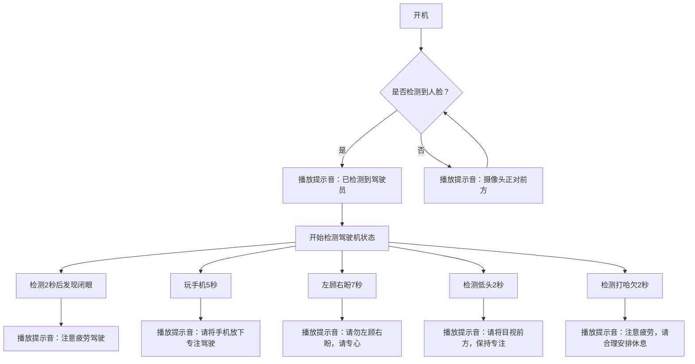

## easyai
AI detects driver drowsiness using the RV1103 platform.

## compile
./build-linux.sh

## usage
excute './adb_push.sh'

## flowchart

[上车测试视频](https://www.bilibili.com/video/BV1fTizYMEKV?vd_source=1b1673dce03ec3272c7540d6228cc14b)

## license
MIT License by Jim
