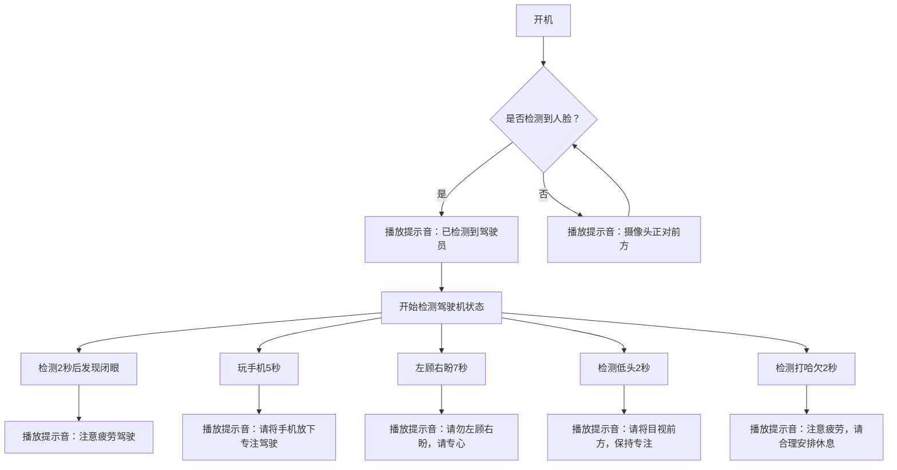

## easyai
AI detects driver drowsiness using the RV1103 platform.

## compile
./build-linux.sh

## usage
excute './adb_push.sh'

## flowchart

[上车红外测试](https://github.com/dreamflyforever/easyai/blob/main/video/ir.mov)

[上车正常测试](https://github.com/dreamflyforever/easyai/blob/main/video/realscene.mov)

[多人测试](https://github.com/dreamflyforever/easyai/blob/main/video/multipeople.mov)

[模型测试](https://github.com/dreamflyforever/easyai/blob/main/video/testmodel.mov)

## license
MIT License by Jim
